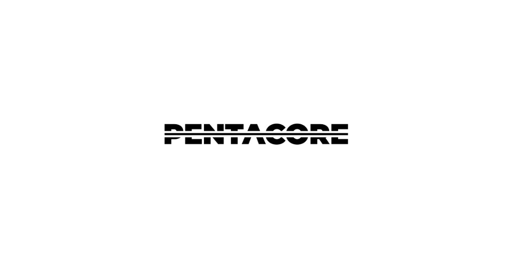

# PENTACORE — Corporate Website

> **We design products that work.**
> IT·AI 개발부터 서비스 운영까지, 기술과 디자인으로 비즈니스의 핵심을 잇는 스튜디오형 팀.

<p align="center">
  
</p>

<p align="center">
  <a href="https://www.pentacore.co.kr">Production</a> · 
  <a href="https://pentacore-sepia.vercel.app">Preview</a> · 
  <a href="mailto:info@pentacore.kr">Contact</a>
</p>

---

## 프로젝트 개요

PENTACORE 공식 홈페이지입니다.
회사 소개, 포트폴리오(Work), 채용(Hiring), 프로젝트 문의(Inquiry) 기능을 포함하며,
모빌리티·AI·웹 분야의 IT 개발 에이전시로서의 브랜드 아이덴티티를 전달합니다.

Next.js 앱 소스는 **`web/`** 디렉터리에 있습니다.

---

## 기술 스택

| 분류 | 기술 |
|------|------|
| **Framework** | Next.js 15 (`^15.5.14`, App Router) |
| **Language** | TypeScript (`^6.0.2`), React 19 (`^19.2.4`) |
| **Styling** | Tailwind CSS `^3.4.17` |
| **Animation** | Framer Motion `^12.38.0` |
| **Icons** | Lucide React `^1.7.0` |
| **UI primitives** | `@base-ui/react` `^1.3.0` |
| **Font** | Geist (Display), Noto Sans KR (본문), Inter (강조) — `web/app/layout.tsx` |
| **Deployment** | Vercel |
| **Domain** | pentacore.co.kr (Production) |

---

## 디렉토리 구조

```
pentacore/
├── docs/                   # 기획 문서
├── web/                    # Next.js 앱 (개발·빌드는 이 폴더 기준)
│   ├── app/
│   │   ├── layout.tsx      # 루트 레이아웃 (메타데이터, 폰트, GlobalCursorProvider)
│   │   ├── page.tsx        # 홈 — 인트로 시퀀스 + 히어로 비디오 + 섹션 카드
│   │   ├── opengraph-image.png / twitter-image.png / icon.png
│   │   ├── about/page.tsx
│   │   ├── work/page.tsx   # 포트폴리오 목록
│   │   ├── works/[slug]/page.tsx  # 포트폴리오 상세
│   │   ├── hiring/page.tsx
│   │   ├── hiring/[slug]/page.tsx
│   │   └── inquiry/page.tsx
│   ├── components/         # about, brand, home, hiring, inquiry, layout, media, nav, subpages, ui, work
│   ├── hooks/              # useBreakpoint 등
│   ├── lib/                # utils, 서브페이지·글래스 토큰 등
│   ├── public/
│   │   ├── video/          # 히어로 등 영상 에셋
│   │   ├── home/           # 인증서, 펜타그램 아이콘 등
│   │   ├── about/          # About 이미지·파트너 에셋
│   │   ├── work/           # Work 목록·썸네일 등
│   │   └── hire/           # Hiring 이미지
│   ├── tailwind.config.js
│   └── package.json
└── README.md
```

---

## 페이지 구성

| 경로 | 페이지 | 설명 |
|------|--------|------|
| `/` | Home | 인트로 애니메이션 → 히어로 비디오 → 4개 섹션 카드 (Work, About, Hiring, Inquiry) |
| `/work` | Work | 포트폴리오 목록 — 현대/기아/제네시스 내비, 삼성, SK엔카, LG전자 등 |
| `/works/[slug]` | Work Detail | 개별 프로젝트 상세 |
| `/about` | About | 철학(Philosophy), 미션(Mission), 파트너 로고, 회사소개서 다운로드 |
| `/hiring` | Hiring | Culture Fit 소개 및 채용 안내 |
| `/hiring/[slug]` | Hiring Job Detail | 채용 공고 상세 |
| `/inquiry` | Project Inquiry | 프로젝트 문의 폼 (서비스 유형·플랫폼·일정·연락처 입력, `mailto` 전송) |

---

## 주요 기능 & 구현 특징

### 홈 인트로 시퀀스
- 최초 방문 시 타이핑 애니메이션 로딩 → 원형 트랜지션(shrink) → 히어로 비디오 재생
- `localStorage`(`pentacore_intro_done`)로 재방문 시 인트로 스킵
- Skip 버튼 제공

### 커스텀 커서
- 마우스 기반 디바이스 감지 (`pointer: fine`)
- 인터랙티브 요소 호버 시 커서 확대 + Glassmorphism 효과
- `mix-blend-difference` 모드로 배경과 자연스러운 대비

### Glassmorphism UI
- 홈 섹션 카드, 네비게이션 바에 `backdrop-blur`, `backdrop-saturate` 적용
- 다크/라이트 서피스 분기 처리

### 반응형 레이아웃
- `useBreakpoint` 훅으로 mobile / tablet / desktop 분기
- 홈 카드 그리드: 모바일 1열 → 태블릿 2열 → 데스크탑 4열
- 네비게이션: 컴팩트(모바일) / 풀(데스크탑) 모드

### 프로젝트 문의 폼
- 서비스 유형: 신규 서비스 / 기존 서비스 개선 / AI·데이터 기반 서비스 / 관리자·운영 시스템 / 아직 정리되지 않음
- 플랫폼: 웹 / 모바일 / 웹+모바일 / 내부 시스템
- 예상 일정: 최대한 빠르게 / 1~2개월 / 3개월 이상 / 아직 검토 중
- 제출은 `mailto:info@pentacore.kr`로 본문 조합 (별도 백엔드 API 없음)

---

## 환경 변수

`web/` 기준 `.env.local`에 설정합니다. 저장소에는 포함하지 않습니다.

| 변수명 | 설명 | 기본값 |
|--------|------|--------|
| `NEXT_PUBLIC_HERO_VIDEO_URL` | 홈 히어로 배경 영상 URL | `/video/hero.mp4` |

상세·운영 가이드는 `docs/07_api-env.md`를 참고합니다.

---

## 시작하기

### 요구사항
- **Node.js** `>=20.9.0` (`web/package.json`의 `engines`)
- **npm** (`web/package-lock.json` 기준)

### 설치 및 실행

```bash
cd web

# 의존성 설치
npm install

# 환경 변수 (선택)
# web/.env.local 을 만들고 NEXT_PUBLIC_HERO_VIDEO_URL 등 필요 시 설정

# 개발 서버 (Turbopack)
npm run dev

# 빌드
npm run build

# 프로덕션 실행
npm start
```

---

## 배포

Vercel에 자동 배포됩니다. 앱 루트 디렉터리는 **`web`** 로 지정하는 것을 권장합니다.

| 환경 | URL | 브랜치 |
|------|-----|--------|
| **Production** | https://www.pentacore.co.kr | `main` |
| **Preview** | https://pentacore-sepia.vercel.app | PR·기타 브랜치 (Vercel Preview) |

원격 저장소 기준으로 **`main`** 이 중심이며, 별도 **`develop`** 브랜치는 두지 않습니다.

---

## 기획 문서

`docs/` 폴더에 기획·스펙 참고 자료가 있습니다.

| 파일 | 설명 |
|------|------|
| [`00_project-overview.md`](docs/00_project-overview.md) | 프로젝트 개요 |
| [`01_product-prd.md`](docs/01_product-prd.md) | PRD (제품 요구 초안) |
| [`02_tech-setup.md`](docs/02_tech-setup.md) | 기술 셋업 |
| [`03_information-architecture.md`](docs/03_information-architecture.md) | 정보 구조 (IA) |
| [`04_screen-spec.md`](docs/04_screen-spec.md) | 화면 스펙 |
| [`05_design-rules.md`](docs/05_design-rules.md) | 디자인 규칙 |
| [`06_data-schema.md`](docs/06_data-schema.md) | 데이터 스키마 (초안) |
| [`07_api-env.md`](docs/07_api-env.md) | API · 환경 변수 |
| [`08_prompt-log.md`](docs/08_prompt-log.md) | 작업 로그 (프롬프트 / 세션) |
| [`09_decision-log.md`](docs/09_decision-log.md) | 의사결정 로그 (ADR 스타일) |
| [`10_qa-checklist.md`](docs/10_qa-checklist.md) | QA 체크리스트 |
| [`11_release-log.md`](docs/11_release-log.md) | 릴리즈 로그 |

---

## 프로젝트 컨벤션

### 브랜치 전략
- **`main`** — 프로덕션 배포
- **기능·수정** — `feature/*`, `fix/*` 등 토픽 브랜치로 작업 후 PR로 `main`에 머지 (팀 합의에 따름)

### 커밋 메시지

저장소 히스토리 기준 **Conventional Commits** 스타일을 사용합니다.

```
feat(scope): 새로운 기능 추가
fix(scope): 버그 수정
docs: 문서 수정
style: UI/스타일 변경
refactor: 코드 리팩토링
chore: 설정/빌드 관련
```

예: `feat(home): …`, `fix(work): …`, `docs: …`

---

## 라이선스

본 프로젝트는 비공개(Private) 프로젝트입니다.
저장소 루트에 별도 `LICENSE` 파일은 없습니다.

Copyright © 2026 PENTACORE. All rights reserved.
